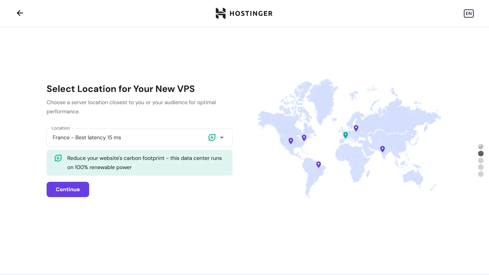
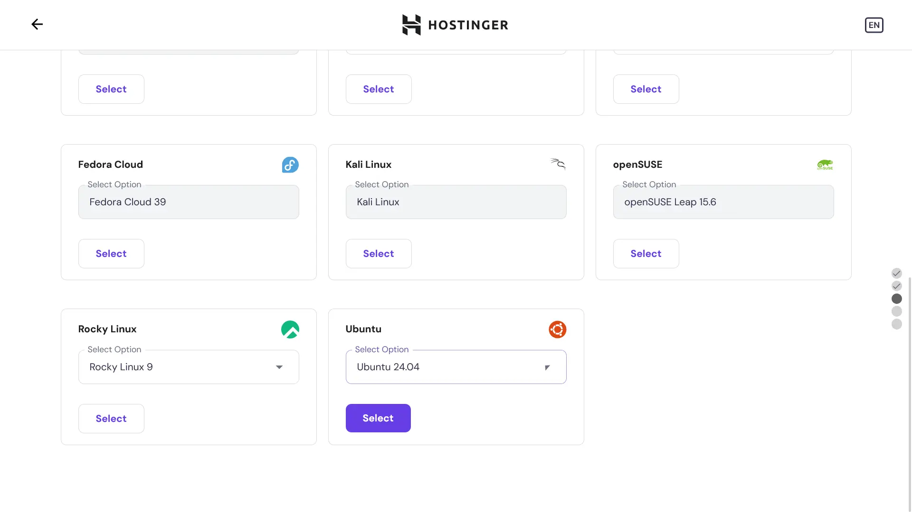
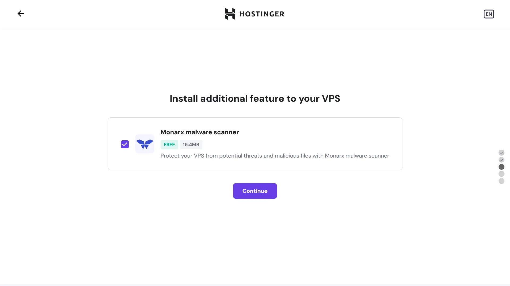
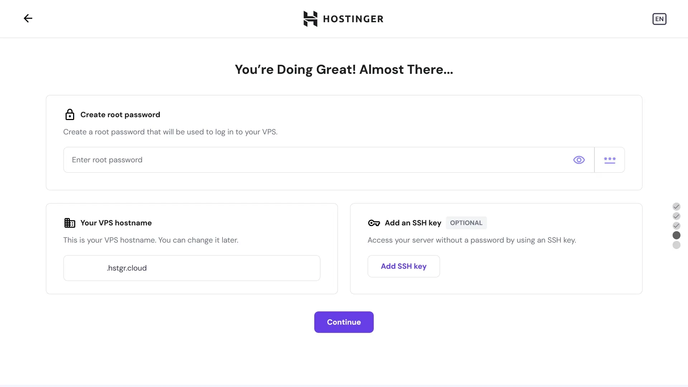
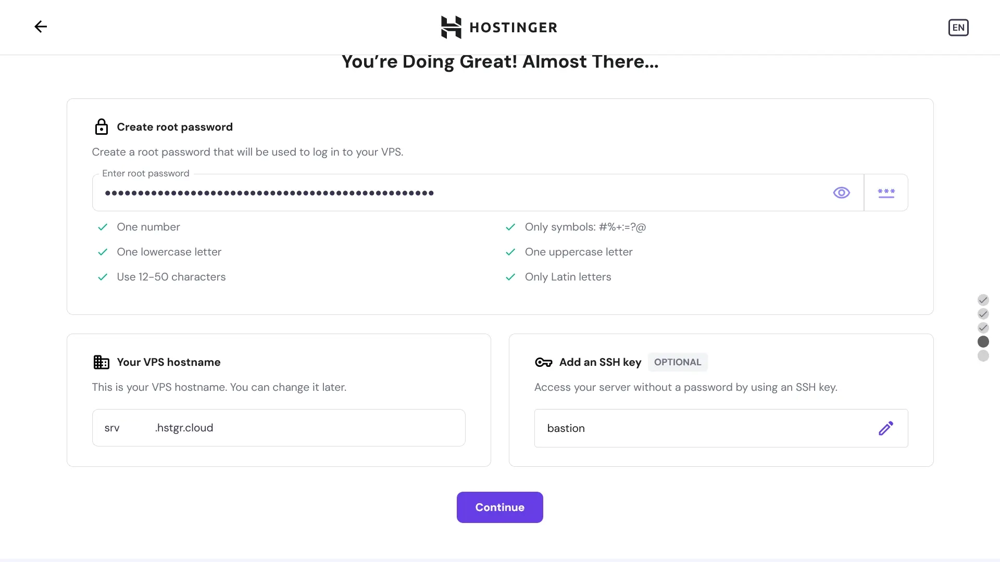
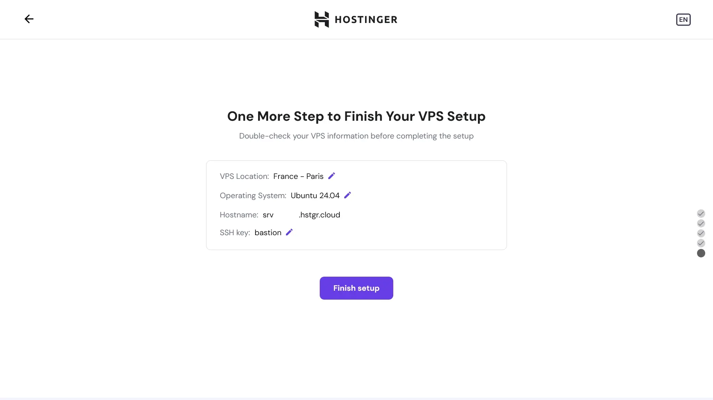
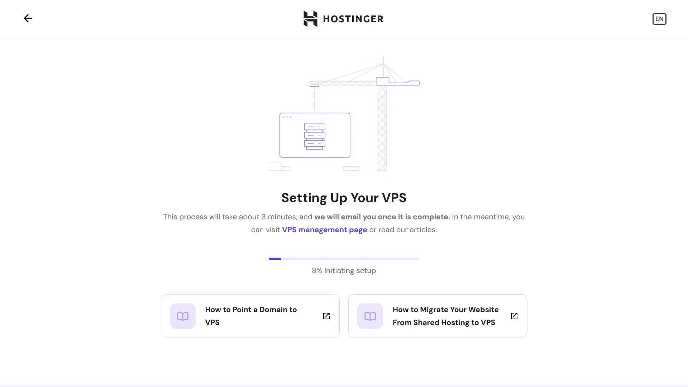
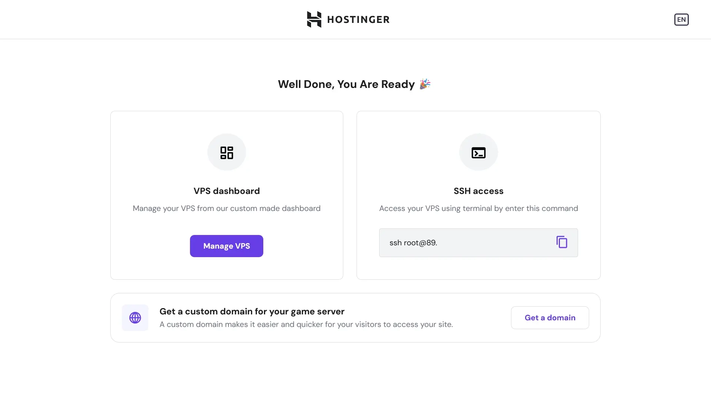
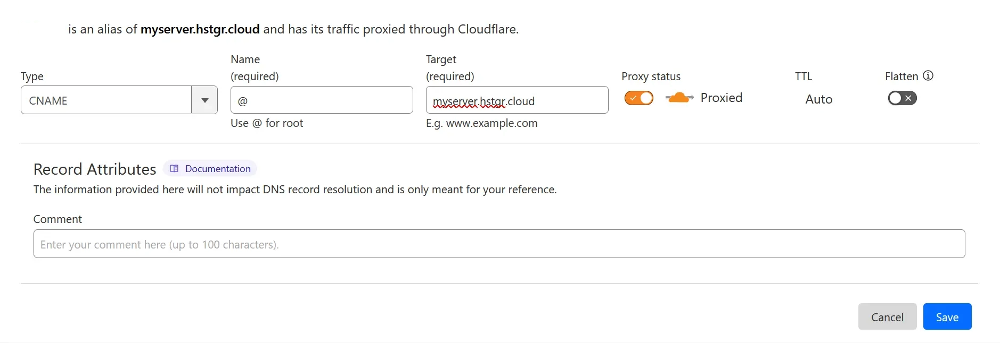

<div align="center">
<h1>
  Revolt Self-Hosted
  
  [](https://github.com/revoltchat/self-hosted/stargazers)
  [](https://github.com/revoltchat/self-hosted/network/members)
  [](https://github.com/revoltchat/self-hosted/pulls)
  [](https://github.com/revoltchat/self-hosted/issues)
  [](https://github.com/revoltchat/self-hosted/graphs/contributors)
  [](https://github.com/revoltchat/self-hosted/blob/main/LICENSE)
</h1>
Self-hosting Revolt using Docker
</div>
<br/>

This repository contains configurations and instructions that can be used for deploying Revolt.

> [!NOTE]
> Please consult _[What can I do with Revolt and how do I self-host?](https://developers.revolt.chat/faq.html#admonition-what-can-i-do-with-revolt-and-how-do-i-self-host)_ on our developer site for information about licensing and brand use.

> [!NOTE]
> amd64 builds are not currently available for the web client.

## Deployment

To get started, find yourself a suitable server to deploy onto, we recommend starting with at least 2 vCPUs and 2 GB of memory.

> [!TIP]
>
> **We've partnered with Hostinger to bring you a 20% discount off VPS hosting!**
>
> 👉 https://www.hostinger.com/vps-hosting?REFERRALCODE=REVOLTCHAT
>
> We recommend using the _KVM 2_ plan at minimum! <br> Our testing environment for self-hosted currently sits on a KVM 2 instance and are happy to assist with issues.

The instructions going forwards will use Hostinger as an example hosting platform, but you should be able to adapt these to other platforms if necessary. There are important details throughout.



When asked, choose **Ubuntu Server** as your operating system, this is used by us in production and we recommend its use.



If you've chosen to go with Hostinger, they include integrated malware scanning which may be of interest:



You should set a secure root password for login (_or disable password login after setup, which is explained later! but you shouldn't make the password trivial until after this is secured at least!_) and we recommend that you configure an SSH key:




Make sure to confirm everything is correct!



Wait for your VPS to be created...

|  |  |
| --------------------------------------------------------- | ------------------------------------------------------------ |

After install, SSH into the machine:

```bash
# use the provided IP address to connect:
ssh root@<ip address>
# .. if you have a SSH key configured
ssh root@<ip address> -i path/to/id_rsa
```

And now we can proceed with some basic configuration and securing the system:

```bash
# update the system
apt-get update && apt-get upgrade -y

# configure firewall
ufw allow ssh
ufw allow http
ufw allow https
ufw default deny
ufw enable

# if you have configured an SSH key, disable password authentication:
sudo sed -E -i 's|^#?(PasswordAuthentication)\s.*|\1 no|' /etc/ssh/sshd_config
if ! grep '^PasswordAuthentication\s' /etc/ssh/sshd_config; then echo 'PasswordAuthentication no' |sudo tee -a /etc/ssh/sshd_config; fi

# reboot to apply changes
reboot
```

Your system is now ready to proceed with installation, but before we continue you should configure your domain.



Your domain (or a subdomain) should point to the server's IP (A and AAAA records) or CNAME to the hostname provided.

Next, we must install the required dependencies:

```bash
# ensure Git and Docker are installed
apt-get update
apt-get install ca-certificates curl git micro
install -m 0755 -d /etc/apt/keyrings
curl -fsSL https://download.docker.com/linux/ubuntu/gpg -o /etc/apt/keyrings/docker.asc
chmod a+r /etc/apt/keyrings/docker.asc

echo \
  "deb [arch=$(dpkg --print-architecture) signed-by=/etc/apt/keyrings/docker.asc] https://download.docker.com/linux/ubuntu \
  $(. /etc/os-release && echo "$VERSION_CODENAME") stable" | \
  sudo tee /etc/apt/sources.list.d/docker.list > /dev/null

apt-get update
apt-get install docker-ce docker-ce-cli containerd.io docker-buildx-plugin docker-compose-plugin
```

Now, we can pull in the configuration for Revolt:

```bash
git clone https://github.com/revoltchat/self-hosted revolt
cd revolt
```

Generate a configuration file by running:

```bash
./generate_config.sh your.domain
```

You can find [more options here](https://github.com/revoltchat/backend/blob/df074260196f5ed246e6360d8e81ece84d8d9549/crates/core/config/Revolt.toml), some noteworthy configuration options:

- Email verification
- Captcha
- A custom S3 server

If you'd like to edit the configuration, just run:

```bash
micro Revolt.toml
```

Finally, we can start up Revolt:

```bash
docker compose up -d
```

## Updating

Before updating, ensure you consult the notices at the top of this README to check if there are any important changes to be aware of **as well as** [the notices](#notices).

Pull the latest version of this repository:

```bash
git pull
```

Check if your configuration file is correct by opening [the reference config file](https://github.com/revoltchat/backend/blob/df074260196f5ed246e6360d8e81ece84d8d9549/crates/core/config/Revolt.toml) and your `Revolt.toml` and comparing for changes.

Then pull all the latest images:

```bash
docker compose pull
```

Then restart the services:

```bash
docker compose up
```

## Additional Notes

### Quick Start (for advanced users)

Prerequisites before continuing:

- [Git](https://git-scm.com)
- [Docker](https://www.docker.com)

Clone this repository.

```bash
git clone https://github.com/revoltchat/self-hosted revolt
cd revolt
```

Copy `.env` and download `Revolt.toml`, then modify them according to your requirements.

> [!WARNING]
> The default configurations are intended exclusively for testing and will only work locally. If you wish to deploy to a remote server, you **must** edit the URLs in `.env` and `Revolt.toml`. Please reference the section below on [configuring a custom domain](#custom-domain).

```bash
echo "HOSTNAME=http://local.revolt.chat" > .env.web
echo "REVOLT_PUBLIC_URL=http://local.revolt.chat/api" >> .env.web
wget -O Revolt.toml https://raw.githubusercontent.com/revoltchat/backend/main/crates/core/config/Revolt.toml
```

Then start Revolt:

```bash
docker compose up -d
```

### Custom domain

To configure a custom domain, you will need to replace all instances of `local.revolt.chat` in the `Revolt.toml` and `.env` files, like so:

```diff
# .env
- REVOLT_APP_URL=http://local.revolt.chat
+ REVOLT_APP_URL=http://my.domain
```

```diff
# Revolt.toml
- app = "http://local.revolt.chat"
+ app = "http://my.domain"
```

You will also want to change the protocols to enable HTTPS:

```diff
# .env
- REVOLT_APP_URL=http://my.domain
+ REVOLT_APP_URL=https://my.domain

- REVOLT_EXTERNAL_WS_URL=ws://my.domain/ws
+ REVOLT_EXTERNAL_WS_URL=wss://my.domain/ws
```

```diff
# Revolt.toml
- app = "http://local.revolt.chat"
+ app = "https://my.domain"

- events = "ws://my.domain/ws"
+ events = "wss://my.domain/ws"
```

In the case of `HOSTNAME`, you must strip the protocol prefix:

```diff
# .env
- HOSTNAME=https://my.domain
+ HOSTNAME=my.domain
```

### Putting Revolt behind another reverse proxy (or on a non-standard port)

Override the port definitions on `caddy`:

```yml
# compose.yml
services:
  caddy:
    ports:
      - "1234:80"
```

> [!WARNING]
> This file is not Git ignored. It may be sufficient to use an override file, but that will not remove port 80 / 443 allocations.

Update the hostname used by the web server:

```diff
# .env
- HOSTNAME=http://local.revolt.chat
+ HOSTNAME=:80
```

You can now reverse proxy to http://localhost:1234.

### Insecurely expose database

You can insecurely expose the database by adding a port definition:

```yml
# compose.override.yml
services:
  database:
    ports:
      - "27017:27017"
```

### Mongo compatibility

Older processors may not support the latest MongoDB version, you may pin to MongoDB 4.4 as such:

```yml
# compose.override.yml
services:
  database:
    image: mongo:4.4
```

### Making your instance invite-only

Enable invite-only mode by setting `REVOLT_INVITE_ONLY` in `.env` to `1` and `invite_only` in `Revolt.toml` to `true`.

Create an invite:

```bash
# drop into mongo shell
docker compose exec database mongosh

# create the invite
use revolt
db.invites.insertOne({ _id: "enter_an_invite_code_here" })
```

## Notices

> [!IMPORTANT]
> If you deployed Revolt before [2022-10-29](https://github.com/minio/docs/issues/624#issuecomment-1296608406), you may have to tag the `minio` image release if it's configured in "fs" mode.
>
> ```yml
> image: minio/minio:RELEASE.2022-10-24T18-35-07Z
> ```

> [!IMPORTANT]
> If you deployed Revolt before [2023-04-21](https://github.com/revoltchat/backend/commit/32542a822e3de0fc8cc7b29af46c54a9284ee2de), you may have to flush your Redis database.
>
> ```bash
> # for stock Redis and older KeyDB images:
> docker compose exec redis redis-cli
> # ...or for newer KeyDB images:
> docker compose exec redis keydb-cli
>
> # then run:
> FLUSHDB
> ```

> [!IMPORTANT]
> As of 30th September 2024, Autumn has undergone a major refactor which requires a manual migration.
>
> To begin, add a temporary container that we can work from:
>
> ```yml
> # compose.override.yml
> services:
>   migration:
>     image: node:21
>     volumes:
>       - ./migrations:/cwd
>     command: "bash -c 'while true; do sleep 86400; done'"
> ```
>
> Then switch to the shell:
>
> ```bash
> docker compose up -d database migration
> docker compose exec migration bash
> ```
>
> Now we can run the migration:
>
> ```bash
> cd /cwd
> npm i mongodb
> node ./20240929-autumn-rewrite.mjs
> ```
